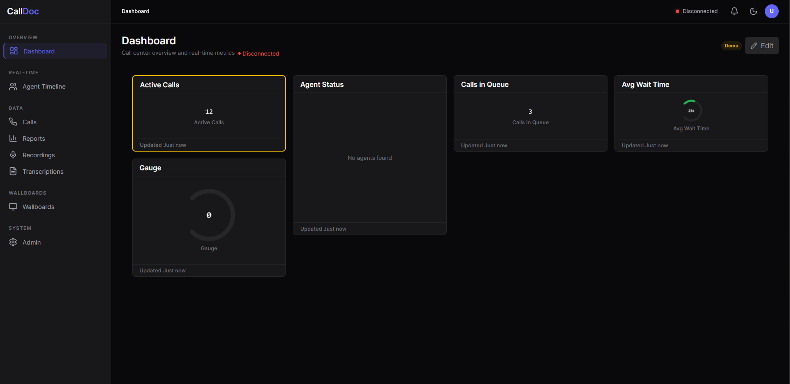
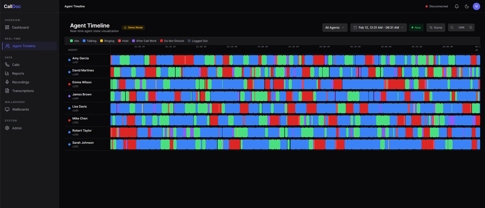
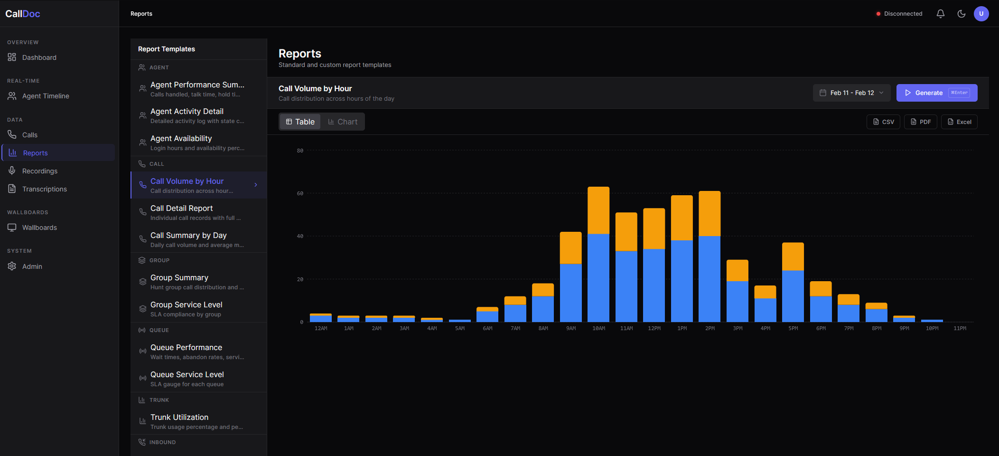
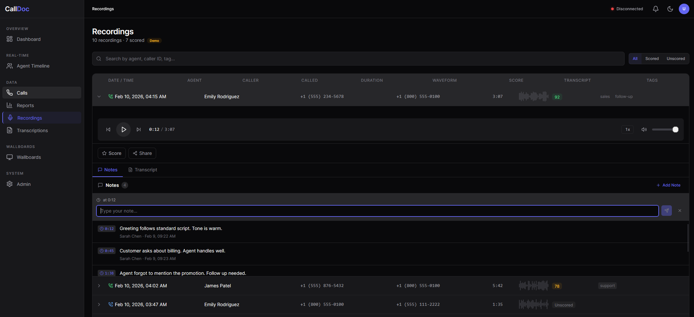
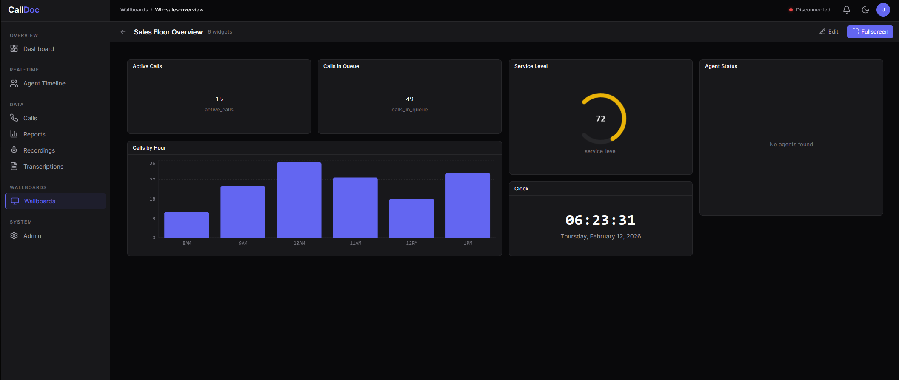
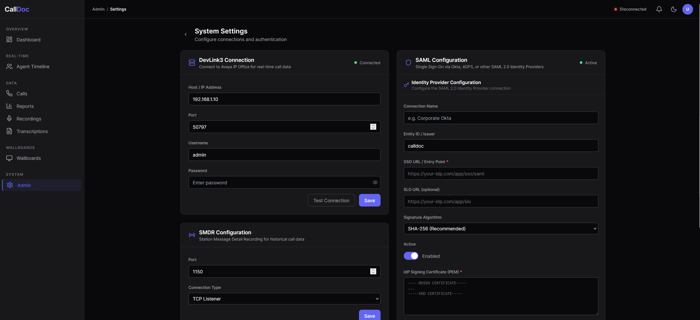

<h1 align="center">CallDoc</h1>

<p align="center">
  <strong>Self-hosted call center reporting for Avaya IP Office 11</strong>
</p>

<p align="center">
  A modern, real-time replacement for Chronicall (Xima) and TASKE &mdash;<br/>
  built with Next.js, PostgreSQL, and Docker.
</p>

<p align="center">
  <a href="#features">Features</a> &bull;
  <a href="#screenshots">Screenshots</a> &bull;
  <a href="#quick-start">Quick Start</a> &bull;
  <a href="#architecture">Architecture</a> &bull;
  <a href="DEPLOY.md">Deployment Guide</a> &bull;
  <a href="#api-docs">API Docs</a>
</p>

<p align="center">
  
  
  
  
  
  
  
</p>

---

## Why CallDoc?

Chronicall (Xima) and TASKE are the standard reporting platforms for Avaya IP Office. They work, but they're expensive, Windows-only, and aging. CallDoc is an open-source alternative that runs anywhere Docker does.

| | Chronicall / TASKE | CallDoc |
|---|---|---|
| **Platform** | Windows Server | Docker (any OS) |
| **Real-time** | Desktop app | Browser-native (WebSocket) |
| **Cost** | Per-seat licensing | Free / self-hosted |
| **Dashboard** | Fixed layouts | Drag-and-drop widgets |
| **Recordings** | Proprietary player | Browser-native Opus + waveform |
| **API** | Limited / SOAP | REST + WebSocket + OpenAPI |
| **SSO** | AD only | SAML 2.0 (any IdP) |
| **Scaling** | Single server | Horizontal with Redis pub/sub |

---

## Features

### Real-Time Dashboard
- **17 widget types** — KPI cards, gauges, charts, agent grids, call lists, group boxes, marquees, clocks, and more
- **Drag-and-drop layout** with react-grid-layout, auto-saved per user
- **Live data** pushed via Socket.io with <100ms latency
- **Demo mode** with realistic sample data when no PBX is connected

### Cradle-to-Grave Call Tracking
- Full call lifecycle visualization from ring to hangup
- DevLink3 real-time events merged with SMDR post-call records
- Correlation engine matches events by call ID or timestamp+extension fallback
- Call notes, tags, and searchable history

### Agent Timeline
- Gantt-chart style visualization of agent state changes throughout the day
- 19 distinct color-coded event types (idle, talking, ringing, hold, ACW, DND, away...)
- Filter by agent, group, date range, or state
- Click any segment for call details

### Reports
- **20 built-in report templates** across 5 categories: Agent, Call, Group, Recording, Trunk
- **30+ calculated metrics** — talk time, hold time, ring time, abandon rate, service level, AHT, etc.
- **Export to CSV, XLSX, and PDF**
- **Scheduled delivery** via email (daily, weekly, monthly)
- **Saved filter presets** per user

### Call Recordings
- Browser-native playback with waveform visualization (wavesurfer.js)
- Opus codec at ~100KB/min for efficient storage
- **PCI compliance** — pause/resume recording during payment card entry
- Quality scorecards for QA review
- Shareable links with optional expiry
- MinIO (S3-compatible) storage with configurable retention policies

### Transcription
- **Speech-to-text** powered by NVIDIA Parakeet TDT 0.6B V2
- Word-level timestamps and confidence scores
- Synchronized playback highlighting — click any word to seek
- Full-text search across all transcripts
- Speaker diarization support
- Mock mode for development (no GPU required)

### Wallboards
- Full-screen display mode for contact center monitors
- Create unlimited wallboard layouts
- Same widget library as dashboards
- Auto-cycling between multiple boards

### Administration
- **User management** with role-based access (Admin, Supervisor, Agent, Viewer)
- **SAML 2.0 SSO** — integrate with Okta, Azure AD, OneLogin, etc.
- **Alert rules** — threshold-based notifications for queue depth, wait time, abandon rate
- **Webhook delivery** for external integrations
- **Audit logging** of all administrative actions
- **Recording rules** — automatic, on-demand, or schedule-based recording triggers

---

## Screenshots

### Dashboard
<!-- Screenshot: Main dashboard with KPI widgets, agent grid, and chart -->
<p align="center">
  
</p>
<p align="center"><em>Real-time dashboard with drag-and-drop widgets showing active calls, agent status, service level gauge, and trend charts</em></p>

### Cradle-to-Grave Call Detail
<!-- Screenshot: Expanded call detail with timeline bar and event list -->
<p align="center">
  
</p>
<p align="center"><em>Complete call lifecycle from inbound ring through transfers, holds, and completion — with timestamped event breakdown</em></p>

### Agent Timeline
<!-- Screenshot: Agent timeline Gantt chart showing state changes -->
<p align="center">
  
</p>
<p align="center"><em>Agent state timeline with color-coded segments — idle, talking, hold, ACW, DND, and away states</em></p>

### Reports
<!-- Screenshot: Report viewer with data table and export options -->
<p align="center">
  
</p>
<p align="center"><em>Report generator with 20 templates, filterable data tables, and CSV/XLSX/PDF export</em></p>

### Call Recordings
<!-- Screenshot: Recording browser with waveform player -->
<p align="center">
  
</p>
<p align="center"><em>Recording browser with waveform visualization, playback controls, notes, and quality scorecard panel</em></p>

### Transcription
<!-- Screenshot: Transcription overview with search and stats -->
<p align="center">
  
</p>
<p align="center"><em>Transcription overview with full-text search, confidence scores, and word-level playback synchronization</em></p>

### Wallboard
<!-- Screenshot: Fullscreen wallboard on a large display -->
<p align="center">
  
</p>
<p align="center"><em>Full-screen wallboard mode designed for lobby and contact center wall displays</em></p>

### Admin Settings
<!-- Screenshot: Admin settings with SAML SSO configuration -->
<p align="center">
  
</p>
<p align="center"><em>DevLink3/SMDR connection config and full SAML SSO management — attribute mapping, group-to-role mapping, and SP metadata</em></p>

---

## Quick Start

### Prerequisites

- [Docker](https://docs.docker.com/get-docker/) 24.0+ and [Docker Compose](https://docs.docker.com/compose/install/) 2.20+
- 4 GB RAM minimum (8 GB recommended)
- Network access to your Avaya IP Office system (TCP 50797 for DevLink3, TCP 1150 for SMDR)

### 1. Clone and Configure

```bash
git clone https://github.com/tacos8me/calldoc.git
cd calldoc
cp .env.example .env
```

Edit `.env` with your Avaya IP Office connection details:

```env
# Avaya IP Office
DEVLINK3_HOST=192.168.1.100      # IP Office IP address
DEVLINK3_PORT=50797
DEVLINK3_USERNAME=admin
DEVLINK3_PASSWORD=your-password
SMDR_PORT=1150

# Security (CHANGE THESE)
SESSION_SECRET=your-random-32-character-secret
NEXTAUTH_SECRET=another-random-32-character-secret
POSTGRES_PASSWORD=strong-database-password
```

### 2. Start Services

```bash
docker compose up -d
```

This starts 7 services:

| Service | Port | Description |
|---------|------|-------------|
| **app** | 3000 | Next.js application |
| **postgres** | 5432 | PostgreSQL 16 database |
| **redis** | 6379 | Redis 7 (pub/sub + cache) |
| **minio** | 9000/9001 | S3-compatible recording storage |
| **devlink3-sim** | 50797 | DevLink3 simulator (dev only) |
| **smdr-sim** | 1150 | SMDR simulator (dev only) |
| **mocksaml** | 5225 | Mock SAML IdP (dev only) |

### 3. Initialize Database

```bash
docker compose exec app npm run db:migrate
docker compose exec app npm run db:seed    # Optional: load demo data
```

### 4. Open CallDoc

Navigate to **http://localhost:3000** and log in with the default admin account.

---

## Architecture

```
                                ┌─────────────────────────────┐
                                │     Avaya IP Office 11      │
                                │                             │
                                │  DevLink3 :50797  SMDR TCP  │
                                └──────┬─────────────┬────────┘
                                       │             │
                          Binary TCP   │             │  CSV over TCP
                                       ▼             ▼
┌───────────────────┐         ┌────────┴─────────────┴─────────┐
│                   │         │        CallDoc App (:3000)      │
│   Browser Client  │◄────────│                                │
│   (Next.js SSR +  │  HTTP / │  DevLink3    SMDR     Correlation
│    Socket.io)     │  WS     │  Connector   Writer   Engine   │
│                   │         │                                │
└───────────────────┘         └──────┬───┬───┬───────────┬─────┘
                                     │   │   │           │
                                     ▼   │   ▼           ▼
                           ┌─────────┐   │ ┌───────┐  ┌───────┐
                           │PostgreSQL│  │ │ Redis │  │ MinIO │
                           │  :5432  │   │ │ :6379 │  │ :9000 │
                           └─────────┘   │ └───────┘  └───────┘
                                         │
                                         ▼
                                   ┌──────────┐
                                   │ Socket.io│
                                   │ (pub/sub)│
                                   └──────────┘
```

### Data Flow

1. **DevLink3 Connector** — Maintains a persistent TCP connection to the IP Office, receiving real-time call and agent state events via the DevLink3 binary protocol (SHA1 challenge-response auth, Delta3 XML parsing)
2. **SMDR Writer** — Listens for SMDR CSV records that arrive 30-60 seconds after call completion with authoritative call detail data
3. **Correlation Engine** — Matches DevLink3 events with SMDR records by `externalCallId` (primary) or `timestamp+extension` (fallback within 5-second window)
4. **Redis Pub/Sub** — Events are published to Redis channels for real-time distribution to all connected app instances
5. **Socket.io** — Pushes real-time updates to browser clients via WebSocket with automatic reconnection
6. **Zustand Stores** — Client-side state stores updated by Socket.io events, powering reactive UI updates with minimal re-renders

### Tech Stack

| Layer | Technology |
|-------|------------|
| **Frontend** | Next.js 14 (App Router), TypeScript strict, React 18, Tailwind CSS |
| **UI Components** | shadcn/ui, Radix Primitives, Recharts, react-grid-layout, wavesurfer.js |
| **Client State** | Zustand (real-time), TanStack Query (REST), nuqs (URL state) |
| **Backend** | Next.js API Routes, Drizzle ORM, node-cron |
| **Database** | PostgreSQL 16 (35+ tables, 23 enums) |
| **Cache / Pub/Sub** | Redis 7 |
| **Auth** | bcryptjs + iron-session (local), SAML 2.0 via @node-saml/passport-saml |
| **Storage** | MinIO (S3-compatible) for recordings |
| **Protocols** | DevLink3 binary TCP, SMDR CSV over TCP |
| **Testing** | Vitest, happy-dom, Testing Library, MSW |
| **Deployment** | Docker Compose, multi-stage Dockerfile (node:20-alpine) |

---

## Project Structure

```
calldoc/
├── src/
│   ├── app/                    # Next.js App Router pages and API routes
│   │   ├── (auth)/login/       # Login page
│   │   ├── (dashboard)/        # Main dashboard layout
│   │   │   ├── page.tsx        # Dashboard home (widget grid)
│   │   │   ├── calls/          # Call log + Cradle-to-Grave
│   │   │   ├── agent-timeline/ # Agent timeline visualization
│   │   │   ├── recordings/     # Recording browser + player
│   │   │   ├── reports/        # Report generator + viewer
│   │   │   ├── wallboards/     # Wallboard list + editor
│   │   │   └── admin/          # Admin panel
│   │   └── api/                # REST API endpoints
│   │       ├── auth/           # Authentication (local + SAML)
│   │       ├── calls/          # Call CRUD + events + notes
│   │       ├── agents/         # Agent list + timeline
│   │       ├── reports/        # Report generation + export
│   │       ├── recordings/     # Recording streaming + metadata
│   │       ├── wallboards/     # Wallboard CRUD
│   │       └── admin/          # User management + settings
│   ├── components/             # React components
│   │   ├── shared/             # Reusable (data-table, filter-builder, etc.)
│   │   ├── dashboard/          # 17 widget components
│   │   ├── recordings/         # Waveform player, PCI controls
│   │   └── ui/                 # shadcn/ui primitives
│   ├── stores/                 # Zustand state stores
│   ├── hooks/                  # React hooks (queries, keyboard, URL filters)
│   ├── lib/
│   │   ├── db/                 # Drizzle ORM schema + migrations
│   │   ├── devlink3/           # DevLink3 protocol (connector, auth, parser)
│   │   ├── smdr/               # SMDR protocol (listener, parser, writer)
│   │   ├── correlation/        # Event correlation engine
│   │   ├── reports/            # Report engine (20 templates, metrics, export)
│   │   ├── recordings/         # Recording storage + transcoding
│   │   ├── auth/               # Session management + middleware
│   │   └── socket/             # Socket.io server + dashboard bridge
│   ├── types/                  # TypeScript type definitions
│   └── test/                   # Test setup + helpers
├── simulators/                 # DevLink3 + SMDR protocol simulators
├── spec/                       # Design specifications + protocol docs
├── drizzle/                    # Database migration files
├── Dockerfile                  # Multi-stage Docker build
├── docker-compose.yml          # Development environment (7 services)
├── docker-compose.prod.yml     # Production overrides
└── DEPLOY.md                   # Deployment guide
```

---

## Development

### Local Setup (without Docker)

```bash
# Install dependencies
npm install

# Start PostgreSQL and Redis (or use Docker for just these)
docker compose up -d postgres redis

# Run database migrations
npm run db:migrate

# Seed demo data
npm run db:seed

# Start the dev server
npm run dev
```

Open **http://localhost:3000**.

### Docker Development

```bash
# Start everything (app + databases + simulators)
docker compose up -d

# Follow app logs
docker compose logs -f app

# Shell into the app container
docker compose exec app sh

# Rebuild after dependency changes
docker compose build app && docker compose up -d app
```

### Available Scripts

| Script | Description |
|--------|-------------|
| `npm run dev` | Start Next.js dev server with hot reload |
| `npm run build` | Production build |
| `npm run start` | Start production server |
| `npm run lint` | Run ESLint |
| `npm run typecheck` | TypeScript strict check |
| `npm test` | Run all tests (Vitest) |
| `npm run test:watch` | Run tests in watch mode |
| `npm run test:coverage` | Run tests with V8 coverage |
| `npm run db:generate` | Generate migration from schema changes |
| `npm run db:migrate` | Apply pending migrations |
| `npm run db:seed` | Seed database with demo data |
| `npm run db:studio` | Open Drizzle Studio (visual DB browser) |

### Testing

```bash
# Run all tests
npm test

# Run specific test file
npx vitest run src/stores/__tests__/call-store.test.ts

# Run tests matching a pattern
npx vitest run --reporter=verbose data-table

# Watch mode
npm run test:watch

# Coverage report
npm run test:coverage
```

---

## API Documentation

CallDoc exposes a RESTful API with OpenAPI 3.0 documentation.

- **Interactive Docs:** http://localhost:3000/api-docs.html (Swagger UI)
- **OpenAPI Spec:** `GET /api/docs` (JSON)

### Key Endpoints

| Method | Endpoint | Description |
|--------|----------|-------------|
| `GET` | `/api/health` | System health check |
| `POST` | `/api/auth/local` | Email/password login |
| `GET` | `/api/calls` | List calls (paginated, filterable) |
| `GET` | `/api/calls/:id` | Get single call with full detail |
| `GET` | `/api/calls/:id/events` | Get call event timeline |
| `GET` | `/api/agents` | List agents with current state |
| `GET` | `/api/agents/:id/timeline` | Get agent state timeline |
| `POST` | `/api/reports/generate` | Generate a report from template |
| `GET` | `/api/recordings` | List recordings |
| `GET` | `/api/recordings/:id/stream` | Stream recording audio |
| `GET/POST` | `/api/wallboards` | List / create wallboards |
| `GET` | `/api/devlink3/status` | DevLink3 connector status |
| `GET` | `/api/groups` | List hunt groups with stats |

### Real-Time Events (Socket.io)

| Event | Direction | Description |
|-------|-----------|-------------|
| `call:started` | Server → Client | New call detected |
| `call:updated` | Server → Client | Call state changed |
| `call:ended` | Server → Client | Call completed |
| `agent:state` | Server → Client | Agent state changed |
| `group:stats` | Server → Client | Hunt group stats updated |
| `queue:update` | Server → Client | Queue metrics changed |

---

## Avaya IP Office Setup

### DevLink3

1. Open **IP Office Manager** → **System** → **Telephony** → **TAPI/DevLink3**
2. Enable **DevLink3** on port `50797`
3. Create an application user with DevLink3 rights under **Security** → **Application Users**
4. Set `DEVLINK3_HOST`, `DEVLINK3_USERNAME`, and `DEVLINK3_PASSWORD` in your `.env`

### SMDR

1. In IP Office Manager → **System** → **SMDR**
2. Enable **SMDR Output** → set to **TCP**
3. Set the **IP Address** to your CallDoc server and **Port** to `1150`

### Recording (Optional)

1. Configure Voicemail Pro to output recordings
2. Recordings are automatically transcoded to Opus codec and stored in MinIO
3. See `DEPLOY.md` for detailed recording setup

---

## Production Deployment

See the full **[Deployment Guide](DEPLOY.md)** for:

- Environment variable reference
- SSL/TLS setup (Nginx, Traefik)
- Horizontal scaling with multiple app instances
- Database backup and restore
- Redis persistence configuration
- Monitoring and health checks
- Troubleshooting guide

### Quick Production Deploy

```bash
# Clone and configure
git clone https://github.com/tacos8me/calldoc.git
cd calldoc
cp .env.example .env
# Edit .env with production values

# Start with production overrides (no simulators)
docker compose -f docker-compose.yml -f docker-compose.prod.yml up -d

# Initialize database
docker compose exec app npm run db:migrate

# Verify
curl http://localhost:3000/api/health
```

---

## Keyboard Shortcuts

| Shortcut | Action |
|----------|--------|
| <kbd>Ctrl</kbd>+<kbd>K</kbd> | Open command palette |
| <kbd>Shift</kbd>+<kbd>E</kbd> | Toggle dashboard edit mode |
| <kbd>?</kbd> | Show keyboard shortcut help |
| <kbd>G</kbd> then <kbd>D</kbd> | Go to Dashboard |
| <kbd>G</kbd> then <kbd>C</kbd> | Go to Calls |
| <kbd>G</kbd> then <kbd>A</kbd> | Go to Agent Timeline |
| <kbd>G</kbd> then <kbd>R</kbd> | Go to Reports |
| <kbd>G</kbd> then <kbd>W</kbd> | Go to Wallboards |
| <kbd>Esc</kbd> | Close modal / exit edit mode |

---

## Contributing

Contributions are welcome! Please:

1. Fork the repository
2. Create a feature branch (`git checkout -b feature/my-feature`)
3. Run tests (`npm test`) and type checks (`npm run typecheck`)
4. Commit your changes with a descriptive message
5. Push to your fork and open a Pull Request

### Code Style

- TypeScript strict mode everywhere
- Drizzle ORM for all database operations
- TanStack Query for REST data fetching, Zustand for real-time state
- shadcn/ui patterns and Tailwind utility classes
- kebab-case files, PascalCase components

---

## Roadmap

- [ ] Agent real-time whisper/barge/listen controls
- [ ] Speech-to-text transcription for recordings
- [ ] Custom report builder (drag-and-drop columns)
- [ ] Mobile-responsive dashboard
- [ ] Prometheus metrics endpoint
- [ ] LDAP/Active Directory sync
- [ ] Multi-tenant support
- [ ] Custom widget development SDK

---

## License

This project is licensed under the [MIT License](LICENSE).

---

<p align="center">
  <sub>Built for Avaya IP Office administrators who deserve modern tools.</sub>
</p>
